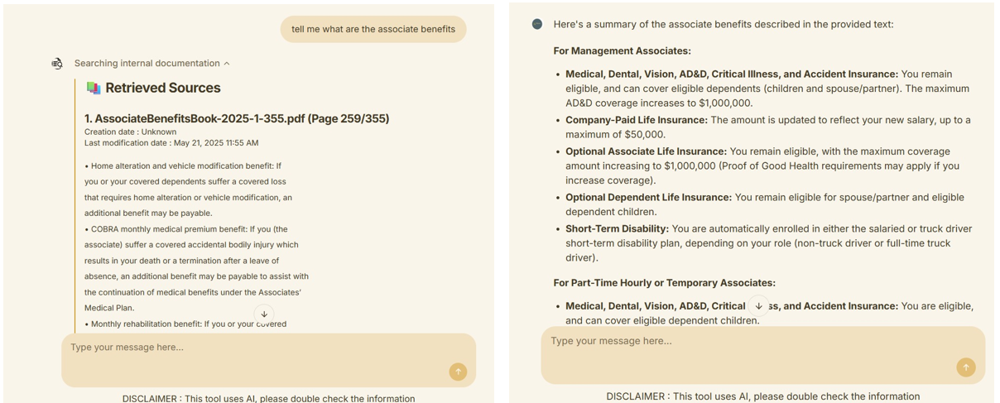

# 🧠 PMAssist – AI-Powered Documentation Assistant

PMAssist is a smart assistant that helps users query and retrieve insights from internal PDF documentation using Google Gemini (LLM and Embeddings), ChromaDB, and LangChain. It supports real-time chat interfaces, document ingestion, source tracking, and automatic outdated-document flagging.

---



---

## 🚀 Features

- 🔍 **Ask questions** about internal documents using natural language
- 📚 **Semantic search** with vector embeddings (Gemini)
- 🧠 **RAG pipeline** with Google Gemini and ChromaDB
- ⚠️ **Flags outdated documents**
- 📄 **Ingests PDFs** into a local ChromaDB vector store
- 💬 **Chat-based UI** built with Chainlit
- 🧩 **Displays source metadata** (document name, page, date)

---

## 📁 Project Structure

- `app.py` – Chainlit UI interface logic
- `brain.py` – Core RAG chain logic using LangChain
- `config.py` – App configuration and environment variables
- `ingest_data_to_chroma.py` – PDF ingestion and embedding logic
- `data/` – Folder for PDF files to ingest

---

## 🧰 Requirements

- Google API key for Gemini
- ChromaDB running locally (docker, you could easily adapt the code for allowing in-memory chromadb)
- `.env` file with `GOOGLE_API_KEY` and `CHROMA_DB_NAME`
- Run a ChromaDB simply in docker:

```bash
docker run -d -p 8000:8000 -v ./chroma_data:/chroma/chroma --name chromadb chromadb/chroma:latest
```

**Install dependencies:**

```bash
`pip install -r requirements.txt`
```

**Example `.env` file:**

```bash
GOOGLE_API_KEY=your_google_api_key_here
CHROMA_DB_NAME=your_collection_name
```

---

## 📥 Ingest Documents

To ingest PDFs from the `./data` folder into ChromaDB:

```bash
python ingest_data_to_chroma.py
```

---

## 💬 Run the Assistant

Start the Chainlit app:

```bash
chainlit run app.py
```

---

## 💡 How It Works

1. PDFs are loaded and split into chunks with metadata.
2. Embeddings are created using Gemini and stored in Chroma.
3. User questions trigger the RAG pipeline.
4. Relevant chunks are retrieved, and Gemini generates an answer.
5. Metadata and warnings (e.g., outdated docs) are displayed in the chat.

---

## 🛠️ Development Notes

- Uses Gemini model `gemini-2.0-flash` for response generation
- Embedding model: `models/embedding-001`
- ChromaDB must be running locally at `localhost:8000`

---

## 📜 License

GNU General Public License v3.0

---

## 👨‍💻 Author

Domingo Paniagua Molina
